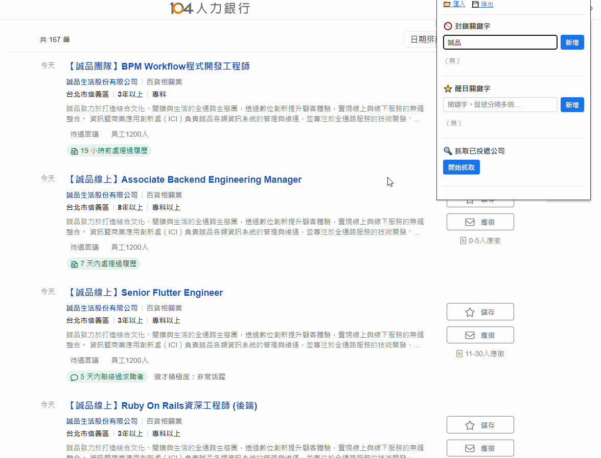
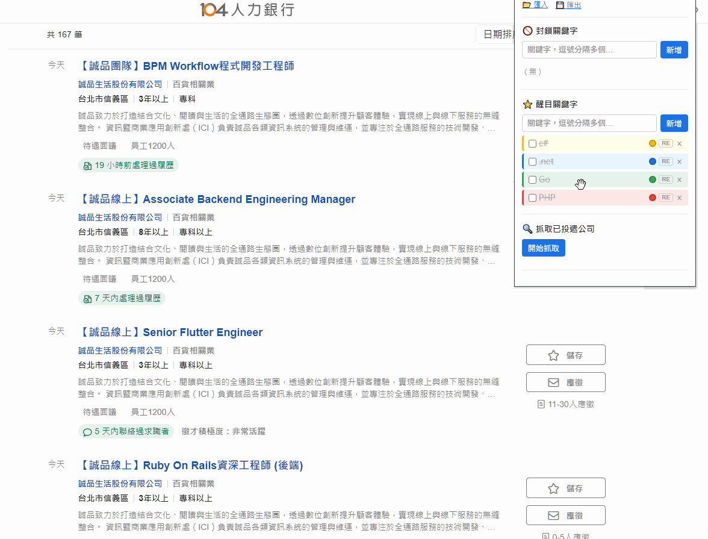
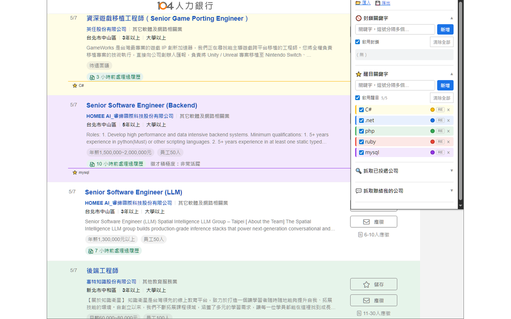
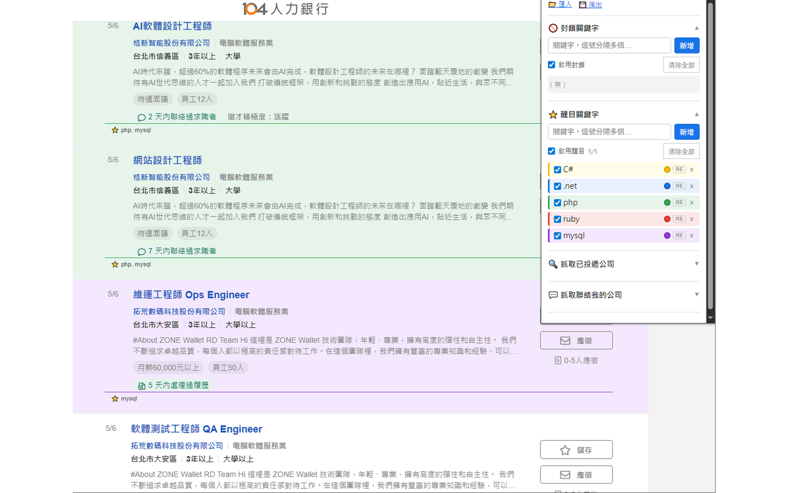

# 104 求職過濾器 | 104 Job Filter

## Demo

**Block keywords**

**Highlight keywords**

---

## 繁體中文

在 [104.com.tw](https://www.104.com.tw) 上自動過濾與標記工作列表的 Chrome 擴充功能。

### 功能

- **封鎖關鍵字** — 隱藏符合關鍵字的工作卡片，移除關鍵字後自動恢復顯示
- **醒目關鍵字** — 以彩色邊框與背景標記符合的卡片
  - 6 種顏色：黃、紅、綠、藍、橙、紫
  - 可拖曳排序 — 第一個符合的關鍵字顏色優先
- **個別控制** — 每個關鍵字可單獨切換 Regex 模式、啟用/停用或刪除
- **全體啟用/停用** — 三態勾選框一鍵切換整個清單；顯示啟用/總數計數
- **清除全部** — 兩次點擊確認，防止誤刪
- **不分大小寫** 的文字比對；可選擇啟用 Regex
- **即時生效** — 新增或移除關鍵字後無需重新整理頁面
- **抓取投遞公司** — 從您的 104 投遞紀錄自動抓取公司名稱，批次加入封鎖或醒目清單
- **抓取聯絡公司** — 從您的 104 訊息紀錄自動抓取曾聯絡您的公司名稱，批次加入封鎖或醒目清單
- **匯入 / 匯出** — 以單一 JSON 檔案備份與還原所有關鍵字

### 安裝方式

#### 從原始碼安裝

1. 下載或 Clone 此專案
2. 開啟 Chrome，前往 `chrome://extensions`
3. 啟用右上角的**開發人員模式**
4. 點擊**載入未封裝項目**，選擇 `104JobFilter` 資料夾

#### Chrome 線上應用程式商店

*即將上架*

### 使用方式

1. 前往 104.com.tw 任意頁面
2. 點擊擴充功能圖示開啟彈出視窗
3. 在**封鎖關鍵字**清單新增關鍵字以隱藏對應工作卡片
4. 在**醒目關鍵字**清單新增關鍵字以彩色標記對應卡片
5. 使用「抓取已投遞公司」或「抓取聯絡我的公司」功能，直接從 104 批次匯入公司名稱

### 隱私權

請參閱[隱私權政策](https://BuiltOutOfNeed.github.io/104JobFilter/privacy-policy.html)。

---

## English

A Chrome extension that filters and highlights job listings on [104.com.tw](https://www.104.com.tw).

### Features

- **Block keywords** — hide job cards that match. Unhides automatically when keyword is removed.
- **Highlight keywords** — mark matching cards with a colored border and background.
  - 6 colors: yellow, red, green, blue, orange, purple
  - Drag to reorder — first matched keyword's color wins
- **Per-keyword controls** — toggle regex mode, enable/disable, or remove each keyword individually
- **Master toggle** — tri-state checkbox to enable/disable all at once; shows enabled/total count
- **Clear all** — two-click confirmation to prevent accidental deletion
- **Case-insensitive** plain text matching; optional regex per keyword
- **Real-time** — changes apply instantly without page refresh
- **Applied company scraper** — fetch all applied company names from your 104 application history and bulk-add them to the block or highlight list
- **Contacted company scraper** — fetch company names that have messaged you on 104 and bulk-add them to the block or highlight list
- **Import / Export** — save and restore all keywords as a single JSON file

### Installation

#### From Source

1. Clone or download this repository
2. Open Chrome and go to `chrome://extensions`
3. Enable **Developer mode** (top right)
4. Click **Load unpacked** and select the `104JobFilter` folder

#### Chrome Web Store

*Coming soon*

### Usage

1. Navigate to any page on `104.com.tw`
2. Click the extension icon to open the popup
3. Add keywords to the **Block** list to hide matching job cards
4. Add keywords to the **Highlight** list to mark matching cards with a colored border
5. Use the scraper sections to bulk-import applied or contacted company names directly from 104

### Privacy

See the [Privacy Policy](https://BuiltOutOfNeed.github.io/104JobFilter/privacy-policy.html).

---

## License

MIT
